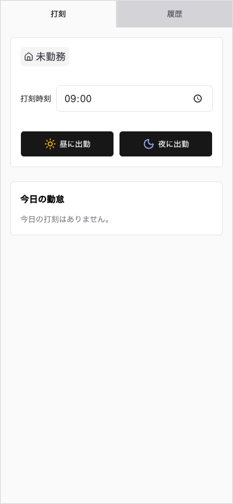
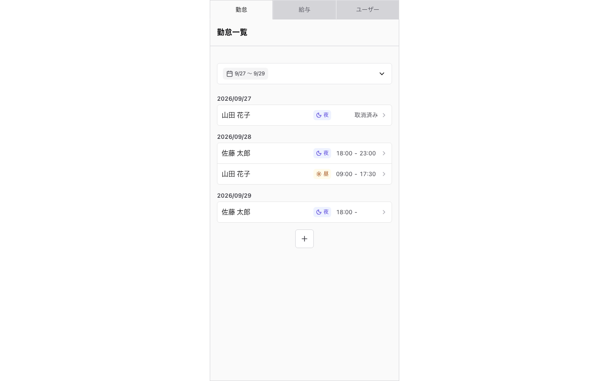
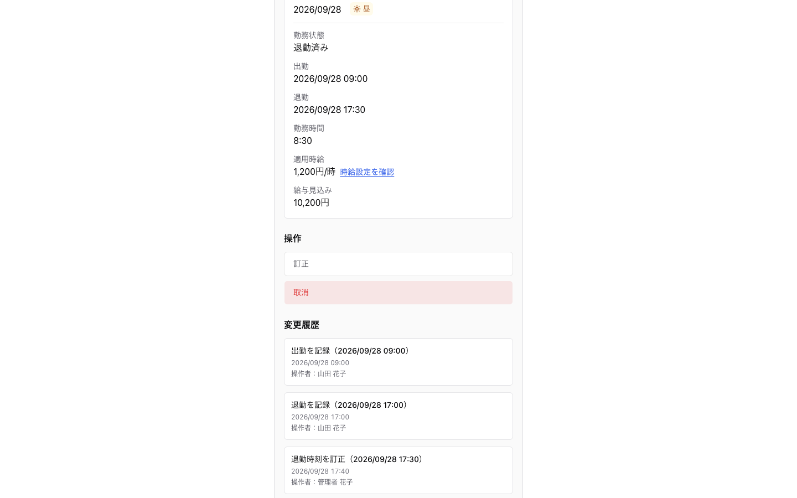
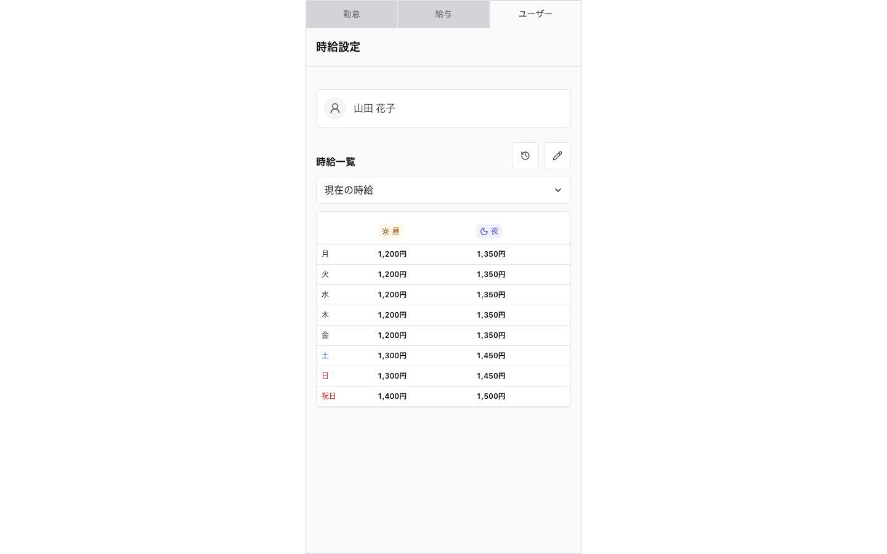
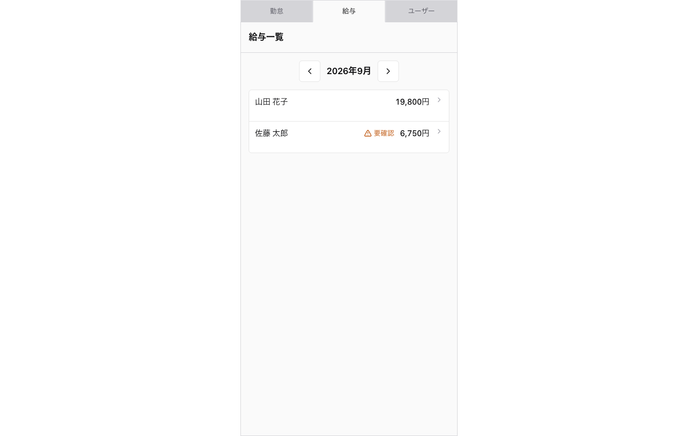
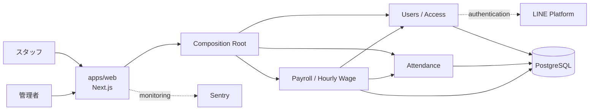

# TimeCard

TimeCard は、小規模店舗向けの勤怠管理 Web アプリケーションです。

スタッフは LINE Login / LIFF で認証し、出勤・退勤、当日の勤務状態、自身の勤怠履歴を確認できます。管理者はユーザー管理、勤怠の新規作成・訂正・取消、変更履歴、時給履歴、月次の給与見込みを扱います。

個人開発として、要件整理・設計・実装・テスト・デプロイ・運用設計まで一貫して取り組んでいます。

> [!NOTE]
> 本リポジトリは、実運用している非公開の TimeCard リポジトリから切り出した転職活動向けの公開スナップショットです。Production の credential・実データ・元の実運用リポジトリの Git 履歴は含めていません。実運用向け GitHub Actions は誤実行を防ぐため無効化し、設定内容を [`.github/workflows-disabled`](./.github/workflows-disabled/) に残しています。

## 開発の目的

小規模店舗の勤怠運用に必要な、スタッフの打刻、管理者による訂正・取消、時給履歴、給与見込みまでを 1 つの Web アプリケーションで扱えるようにすることを目的に開発しています。

機能を増やすだけでなく、業務ルールを UI や ORM から分離し、変更履歴、競合更新、テスト、デプロイ、バックアップまで含めて継続運用できる構成を重視しています。

## 主な機能

- LINE Login / LIFF を利用したスタッフ認証
- 出勤・退勤と勤怠履歴の確認
- 管理者による勤怠の新規作成・訂正・取消
- 勤怠変更履歴の保持
- 曜日・祝日・昼夜区分を考慮した時給管理
- 月次の勤務時間・給与見込みの集計
- ユーザーの承認・利用停止・表示名管理

## 画面

掲載している画面は、すべてポートフォリオ撮影用の架空データを使用しています。画像をクリックすると原寸で確認できます。

### スタッフ画面

<table>
  <tr>
    <td align="center">
      <strong>未勤務</strong><br>
      <a href="./docs/portfolio/screenshots/01-staff-clock-not-working.png">
        
      </a>
    </td>
    <td align="center">
      <strong>勤務中</strong><br>
      <a href="./docs/portfolio/screenshots/02-staff-clock-working.png">
        
      </a>
    </td>
  </tr>
</table>

### 管理画面

#### 勤怠一覧

[](./docs/portfolio/screenshots/03-admin-attendance-list.png)

#### 勤怠詳細・変更履歴

[](./docs/portfolio/screenshots/04-admin-attendance-detail.png)

#### 時給設定

[](./docs/portfolio/screenshots/05-admin-hourly-wage.png)

#### 給与一覧

[](./docs/portfolio/screenshots/06-admin-payroll-list.png)

## 技術構成

| 領域            | 主な技術                                                |
| --------------- | ------------------------------------------------------- |
| Web             | Next.js、React、TypeScript                              |
| Server          | Next.js Server Components / Server Actions、TypeScript  |
| Database        | PostgreSQL、Neon、Drizzle ORM                           |
| Authentication  | LINE Login / LIFF                                       |
| Test            | Vitest、Node.js Test Runner、Playwright、Testcontainers |
| UI verification | Storybook、axe                                          |
| Monitoring      | Sentry                                                  |
| Monorepo        | pnpm workspace、Turborepo                               |
| Quality         | Biome、TypeScript、Knip、cspell、textlint、Lefthook     |

## 設計・実装で見てほしいポイント

### 1. 業務境界を基準とする Modular Monolith

Users / Access、Attendance、Payroll Estimate / Hourly Wage を主要な業務境界として分け、各 package が Domain、Application、Infrastructure と業務固有 schema を所有します。

Domain と Application は Next.js、Drizzle、PostgreSQL、LINE などの具体技術から分離し、`apps/web` を Delivery Adapter / Composition Root として依存を組み立てています。

- [設計書](./docs/設計書.md)
- [ADR 0002: 業務境界を基準とする Modular Monolith](./docs/adr/0002-modular-monolith-with-domain-boundaries.md)
- [`packages/users`](./packages/users/)
- [`packages/attendance`](./packages/attendance/)
- [`packages/payroll`](./packages/payroll/)

### 2. 勤怠を Event Stream と Current State Projection で管理

勤怠の出勤・退勤・訂正・取消を Event として追記し、変更履歴を Source of Truth としています。通常の読み取りでは Current State Projection を利用し、Event Store が正常であれば Projection を再構築できる構成です。

この方式をシステム全体へ一律に適用せず、変更履歴を原本として扱う価値がある Attendance に限定しています。

- [Attendance Aggregate](./packages/attendance/src/domain/attendance.ts)
- [ADR 0001: 勤怠を Event Stream と Current State Projection で管理する](./docs/adr/0001-attendance-event-stream-and-current-state-projection.md)

### 3. 業務ルールと競合更新を複数の境界で保証

出退勤の状態遷移、日時の整合性、取消後の操作などは Domain で表現し、永続化時には PostgreSQL の transaction・constraint と version による競合検知も利用します。

UI の表示制御だけを認可や整合性の根拠にせず、server / application / database の各境界で必要な保証を持たせています。

### 4. Small / Medium を使い分けたテスト戦略

純粋な Domain・Application・UI の振る舞いは Small Test、PostgreSQL 固有の query / transaction / constraint / migration と主要ユーザーフローは Medium Test で検証します。

現在の Playwright E2E は Medium Test に分類しています。Medium Test では Testcontainers の PostgreSQL 18、Playwright、実際の Next.js runtime を利用し、主要フローと axe によるアクセシビリティ検査まで確認します。Storybook は認証や実 DB を必要としない UI の確認に利用しています。

- [テスト方針](./docs/テスト方針.md)
- [Playwright E2E](./apps/e2e/)
- [`pnpm quality` の実装](./scripts/run-quality.mjs)

### 5. AI エージェントを前提にしたガードレール

AI エージェントを開発補助に利用していますが、自由なファイル変更に依存しないよう、repository-local rule と機械的な guard を組み合わせています。

たとえば DB migration は schema 変更と正規 generator からのみ生成する方針とし、Codex の PreToolUse hook で migration ファイルへの直接編集・削除・迂回コマンドを拒否します。

- [AI エージェント向けルール](./AGENTS.md)
- [開発ルール](./CONTRIBUTING.md)
- [Migration guard](./.codex/hooks/migration-guard.mjs)
- [Migration guard のテスト](./scripts/codex-migration-guard.small.test.mjs)

### 6. 実装だけでなくデプロイ・バックアップまで管理

スナップショット元では、Quality が成功した revision だけを Preview / Production deployment の候補にし、Production DB のバックアップも GitHub Actions で自動化しています。

公開用リポジトリから実環境へ接続しないよう Actions は無効化していますが、設計内容を確認できるよう workflow 自体は残しています。

- [Quality / Preview / Production workflow](./.github/workflows-disabled/quality.yml)
- [Production DB Backup](./.github/workflows-disabled/backup-production-db.yml)
- [Production DB Backup Scheduler](./.github/workflows-disabled/backup-production-db-scheduler.yml)
- [運用保守手順書](./docs/運用保守手順書.md)

## アーキテクチャ



単一の Next.js application と単一の PostgreSQL を維持しつつ、コード上では業務境界と依存方向を明示する構成です。詳細は [設計書](./docs/設計書.md) を参照してください。

## リポジトリ構成

- `apps/web`: staff、`/admin`、Server Components、Server Actions、Composition Root を提供する Next.js アプリ
- `apps/e2e`: Medium Test に分類する Playwright E2E
- `packages/users`: Users / Access の Domain、Application、Infrastructure、schema、LINE 認証 adapter
- `packages/attendance`: Attendance の Domain、Application、Infrastructure、schema
- `packages/payroll`: Payroll Estimate / Hourly Wage の Domain、Application、Infrastructure、schema
- `packages/contracts`: Server Action 用の入力 schema と Delivery 固有の共有型
- `packages/db`: 各業務 schema の合成、Drizzle database、migration
- `packages/platform`: schema に依存しない PostgreSQL 接続基盤
- `packages/server`: server runtime の環境設定と運用 CLI
- `packages/ui`: staff / admin 共通 UI

## 品質確認

依存関係をインストールします。

```sh
pnpm install --frozen-lockfile
```

標準の品質ゲートは次です。

```sh
pnpm quality
```

`pnpm quality` では、静的チェック、typecheck、Small Test、Web build、Storybook static build、Medium Test をまとめて実行します。

個別には次の入口も利用できます。

```sh
pnpm test:small
pnpm test:medium
pnpm test:e2e
```

`pnpm test:e2e` は Small / Medium と並ぶ別のテストサイズではなく、E2E Scope 全体を実行するための入口です。現在の Playwright E2E は Medium Test に分類され、`pnpm test:medium` にも含まれます。

開発ルール、DB migration、ドキュメント更新等の詳細は [CONTRIBUTING.md](./CONTRIBUTING.md) を参照してください。

## ローカル起動

通常の Web 開発サーバーは次で起動します。

```sh
pnpm dev:web
```

実 LINE / LIFF 認証を含む環境構築は [環境構築・デプロイ手順書](./docs/環境構築・デプロイ手順書.md) を参照してください。Production の credential や実データは本リポジトリに含まれません。

## ドキュメント

| 文書                                                                                | 役割                                                                     |
| ----------------------------------------------------------------------------------- | ------------------------------------------------------------------------ |
| [要件定義書](./docs/要件定義書.md)                                                  | 利用者・業務・システムが満たす要求                                       |
| [設計書](./docs/設計書.md)                                                          | システム方式、主要コンポーネント、責務・境界、主要フロー、重要な設計制約 |
| [用語集](./docs/用語集.md)                                                          | 主要な業務境界ごとの業務用語と意味                                       |
| [テスト方針](./docs/テスト方針.md)                                                  | テスト戦略、分類、品質保証の考え方、実行方法                             |
| [環境構築・デプロイ手順書](./docs/環境構築・デプロイ手順書.md)                      | ローカル環境、Vercel、Neon、migration、リリース手順                      |
| [運用保守手順書](./docs/運用保守手順書.md)                                          | 定常確認、障害対応、データ保全、保守作業                                 |
| [利用者マニュアル](./docs/利用者マニュアル.md)                                      | staff / admin の利用方法                                                 |
| [ADR 0001](./docs/adr/0001-attendance-event-stream-and-current-state-projection.md) | 勤怠の Event Stream / Current State Projection の設計判断                |
| [ADR 0002](./docs/adr/0002-modular-monolith-with-domain-boundaries.md)              | 業務境界を基準とする Modular Monolith の設計判断                         |

## この公開リポジトリについて

このリポジトリは転職活動で成果物を確認できるように、実運用リポジトリの特定時点を切り出した公開用スナップショットです。第二の開発リポジトリとして継続同期することは前提としていません。

公開にあたり、主に次の点を実運用リポジトリから変更しています。

- Production の credential、実データ、元の実運用リポジトリの Git 履歴は含めていません。
- GitHub Actions は誤実行防止のため `.github/workflows-disabled` へ移動しています。
- DB migration は公開用スナップショットの現行 schema を表す [`0000_initial_schema.sql`](./packages/db/migrations/0000_initial_schema.sql) に baseline 化しています。

AI エージェントの利用を含む開発ルール、テスト、設計書、ADR、運用ドキュメントは、実装や設計判断を確認できる材料として残しています。
