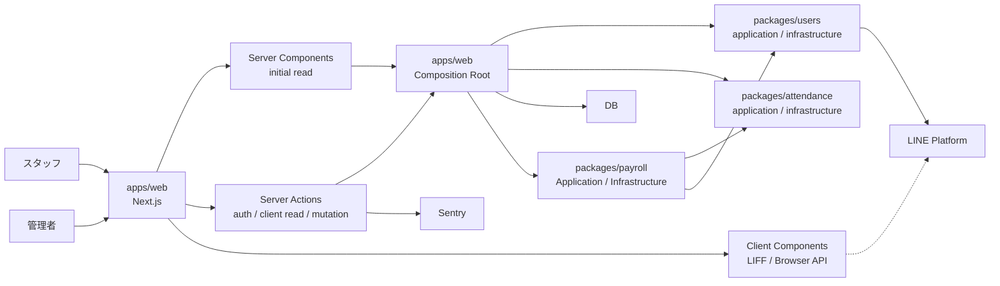

# 設計書

## 1. 文書の役割

本書は、[要件定義書](./要件定義書.md) で定めた要求を、システム方式、主要コンポーネント、責務・境界、主要処理フロー、重要な設計制約へ具体化する。

独立した詳細設計書は設けない。ファイル・関数、API の全 endpoint、DB 列、個別 error code などコードから直接確認できる詳細は重複記載せず、ソースコード、共有 contracts、DB schema、migration を詳細レベルの Source of Truth とする。

## 2. 設計方針

本システムは、業務境界を第一基準に Domain、Application、Infrastructure の責務を分ける Modular Monolith を採用する。Web UI、永続化、外部認証との依存方向を含む全体構成は 3.2 節に記載する。

主要方針は次のとおり。

1. **単一 Next.js アプリ内で UI と server の責務を分離する**  
   スタッフ向け画面は通常の入口、管理者向け画面は `/admin` として同一アプリ・同一 origin で提供する。初期表示の業務データ読み取りは Server Components / server helper を基本とし、認証と状態変更は Server Actions から `apps/web` の Composition Root を通じて `packages/users`、`packages/attendance`、`packages/payroll` の application 処理へ接続する。画面内での再取得や client-side cache 調整が必要な箇所では、Client Component から read-oriented Server Action を利用できる。
2. **サーバー側での認証・認可**  
   LINE の認証結果と本システムのセッションは server 側で検証し、管理者権限や利用状態をクライアント表示だけに依存せず保証する。
3. **業務ルールの共有化**  
   勤怠・時給・給与集計などの主要ルールをドメイン層へ集約し、UI 固有実装への依存を避ける。
4. **PostgreSQL を主要永続化先とする**  
   ユーザー、セッション、勤怠イベント、時給履歴を PostgreSQL に保持する。
5. **勤怠の変更履歴を継続保持する**
   勤怠は変更イベントを蓄積し、Event Stream から現在状態を再構成する。訂正・取消の経緯と操作者を追跡可能にし、通常の勤怠操作を理由に Event Stream を削除しない。
   この判断の背景・代替案・トレードオフは [ADR 0001](./adr/0001-attendance-event-stream-and-current-state-projection.md) を参照する。
6. **競合更新を拒否する**  
   勤怠変更では version を用いた競合検知を行い、古い状態からの上書きを防ぐ。
7. **UI の重要なレイアウト不変条件を構造で保証する**  
   列揃え、表示領域の幅、状態差による配置など、利用者が継続して認識すべきレイアウトは、コンテンツ長や暗黙の空白、画面を見ながら調整した magic number に依存させず、共通の grid track、固定 slot、共有 component 等によって、コードから成立条件を説明できる構造にする。実ブラウザ確認は行うが、構造で保証できる性質の成立を目視調整だけに依存させない。

## 3. システム全体構成

### 3.1 現行実装



| コンポーネント    | 責務                                                                              |
| ----------------- | --------------------------------------------------------------------------------- |
| apps/web          | staff、`/admin`、Server Components、Server Actions を提供する単一 Next.js runtime |
| staff UI          | スタッフ向け認証、当日状態、勤務中状態、履歴、打刻                                |
| `/admin` UI       | 管理者向け認証、ユーザー、勤怠一覧、給与、時給、勤怠の変更履歴・編集              |
| Server Components | server 側での初期業務データ読み取りと初期表示                                     |
| Server Actions    | LINE 認証によるセッション作成、必要な client-side read、業務 mutation             |
| server            | server runtime の環境設定と運用 CLI                                               |
| users             | ユーザー・認証・認可と LINE 検証、セッション永続化                                |
| contracts         | Server Action 用入力 schema と Delivery 固有の共有型、複数業務で共有する型        |
| payroll           | Payroll の Domain、Application、Infrastructure、schema                            |
| db                | 各業務 schema の合成、Drizzle database、migration、接続処理                       |
| platform          | schema に依存しない PostgreSQL 接続文字列の正規化、DB factory、共通 DB type       |
| ui                | staff/admin 共通の design system・汎用 UI                                         |
| PostgreSQL        | 現行システムの主要データ永続化                                                    |
| Sentry            | server 処理の予期しない例外の監視                                                 |

`apps/web` を 1 つの Vercel deploy 単位として運用する。staff、admin のために独立した deploy や origin は持たない。内部業務処理のための汎用 REST API も持たない。PostgreSQL は Neon を利用し、Local、develop / Preview、Production の接続先と secret を相互に分離する。Production 環境は構築済みであり、`main` の検証済み revision を Vercel Production deployment へ反映する。具体的な deployment、migration、接続先管理は [環境構築・デプロイ手順書](./環境構築・デプロイ手順書.md) を参照する。

### 3.2 業務境界と依存方向

業務境界を package 分割の第一基準とする DDD + Clean Architecture に基づく Modular Monolith として構成する。主な境界は Users / Access、Attendance、Payroll Estimate / Hourly Wage とし、それぞれ `packages/users`、`packages/attendance`、`packages/payroll` が Domain、Application、Infrastructure と業務固有 schema を所有する。`apps/web` の Composition Root は各業務モジュールの Application と Infrastructure を組み立て、必要な業務間の連携を外側で構成する。

依存方向は内側へ向ける。Domain は Next.js、Drizzle、PostgreSQL、LINE 等の外部技術から独立させる。Application は use case と Port を所有し、具体的な Infrastructure、ORM、DB、Web framework に依存しない。各業務モジュールの Infrastructure は Application の Port を実装する。業務別 Repository、Store、外部連携 Adapter はそのモジュールに置き、共通 Infrastructure に集約しない。

共通 Platform は DB 接続、設定、監視など業務知識を持たない横断的な技術責務に限定する。user、勤怠、時給、給与の schema や業務ルールは含めない。`apps/web` は Delivery Adapter / Composition Root として、Server Components / Server Actions から use case を呼び出し、外側で必要な依存を組み立てる。

業務 Application の読み取りモデルと意味・構造が同じ共有型は、業務 package の公開 root boundary を canonical type とする。`packages/contracts` は廃止せず、Server Action 用 Zod schema / request type と、合成された管理画面モデルや Date の serialized string 化など Delivery 固有差分を所有する。重複する型定義は canonical type を参照し、共有部分から Delivery 差分を導出する。依存方向は `packages/contracts` から Attendance / Payroll の公開 root のみに許可し、業務 Domain / Application から contracts への依存は禁止する。

現時点の `packages/platform` は schema に依存しない PostgreSQL 接続基盤を所有する。Users schema の定義は `packages/users` が所有し、`packages/db` は各業務 schema を合成して `getDatabase` を提供する。共通の `PostgresDatabase` type は `packages/platform` が所有する。物理 DB の migration は引き続き `packages/db` が所有する。

依存方向は Biome の import 制約と Small Test で検証する。Users と Attendance の Domain は Application / Infrastructure / schema / Platform / Delivery に依存せず、Application は Infrastructure / schema / Platform / Delivery に依存しない。Payroll Domain と Application は Next.js、Drizzle、PostgreSQL、contracts、DB、Infrastructure に依存しない。各 Infrastructure は自モジュールの Application / Domain と Platform を利用できるが、`packages/db` へ逆依存しない。他の業務処理と Delivery は Payroll 内部 subpath を直接 import せず、公開 boundary を利用する。`apps/web` の Composition Root は各モジュールの Infrastructure を組み立て、`packages/db` の schema 合成点は各モジュールの schema を組み込める。既存の production bootstrap CLI も delivery adapter として Users Infrastructure を組み立てる。Payroll PostgreSQL adapter と Hourly Wage schema は `packages/payroll` が所有する。`packages/platform` の独立性、および相対 import の循環検出も維持する。

業務モジュール間では、別モジュールの内部 subpath へ package alias や相対 path で直接 import しない。同一モジュール内では定めた依存方向に従い、Infrastructure から自モジュールの Application / Domain と共通 Platform を利用できる。

単一の Next.js application、単一の PostgreSQL、staff/admin 共通 origin を維持する。業務モジュールを独立 deploy や複数 DB へ分割せず、内部業務処理のための独立 Backend API も設けない。Value Object や Aggregate は業務上の不変条件が必要な箇所に導入し、形式的には増やさない。移行時に利用した旧構造や互換 API は恒久的な目標構成とはしない。背景と代替案は [ADR 0002](./adr/0002-modular-monolith-with-domain-boundaries.md) に記録する。

## 4. 認証・認可

staff の通常入口と `/admin` は、まず既存の本システムのセッションを利用できるか server 側で確認する。有効なセッションがある場合はそのまま利用し、セッション作成または再認証が必要な場合に Client Component が LINE Login / LIFF から認証情報を取得する。取得した認証情報は Server Action から `packages/users` の authentication application へ渡し、server 側で LINE Platform に対して検証して LINE user ID を本システムの利用者と対応付ける。1 つの LINE user ID は 1 人の利用者へ一意に対応付ける。

LIFF の Endpoint URL である `/` は、LINE 認証からの復帰を受け付ける入口として扱い、server 側で無条件に `/clock` へリダイレクトしない。`/` では既存の本システムのセッションを確認し、Client Component が認証状態に応じて遷移を制御する。既存セッションが有効で、LIFF 認証からの復帰情報を含まない場合は、追加の LINE 認証を行わず `/clock` へ遷移する。既存セッションが有効でも復帰情報を含む場合は、再ログインを自動開始せず、LIFF の初期化を完了してから `/clock` へ遷移する。既存セッションがない場合は、LIFF の初期化と必要な LINE 認証を行い、本システムのセッションの作成に成功してから `/clock` へ遷移する。認証中は勤怠データや打刻操作を表示せず、認証失敗・承認待ち・利用停止の場合は対応する状態を表示して画面遷移しない。打刻画面の `/clock` と履歴画面の `/history` は維持する。

LINE による本人確認と本システムの利用許可は別の状態として扱う。LINE 本人確認に成功した user が本システムに未登録の場合は staff の承認待ち状態で user を作成し、管理者が承認するまでは本システムのセッションを作成しない。初回登録時には LINE 表示名を trim し、1〜100 Unicode コードポイントなら本システムの `displayName` 初期値として保存する。空または上限超過の場合は `displayName` を null として承認待ち登録を成立させ、管理者が設定する。既存の LINE user が再認証した場合は LINE user ID による本人識別を継続するが、LINE 側の表示名で本システムの `displayName` を更新しない。本システムの `displayName` は初回登録後、LINE プロフィールから独立した業務用名称として保持する。

スタッフの利用状態は、承認待ち、利用可能、利用停止を区別する。セッション作成時は利用状態を整合性境界内で確認し、利用可能な user にだけ本システム独自の session cookie を発行する。セッションは user、有効期限、失効状態を持ち、ブラウザでは本システム独自の session cookie により継続認証する。独自の CSRF token を session state として保持しない。

管理者はユーザー画面のスタッフ一覧から承認待ちの staff を確認し、対象の詳細画面で承認待ちから利用可能へ変更することで利用を承認する。承認操作自体では対象 staff のセッションを作成せず、承認後に対象 staff が LINE 認証を行った時点で新しいセッションを作成する。承認待ちから利用停止への変更、および利用可能・利用停止から承認待ちへの変更は許可しない。

管理者は承認待ち・利用可能・利用停止のいずれの staff についても、本システムの業務用 `displayName` を変更できる。管理者自身についても、ユーザー詳細画面から本人の業務用 `displayName` を設定・変更できる。表示名変更の Server Action は認証済みセッションから操作者の userId を解決し、Application は対象 user の最新 role と userId を確認して、他の管理者の表示名変更を拒否する。画面上の操作制御だけに認可を依存させない。入力値は前後空白を除去した 1〜100 Unicode コードポイントとし、文字種は制限しない。staff の `displayName` 未設定を正常状態として許容するのは承認待ちだけとし、利用可能・利用停止の staff はこの範囲内の業務用 `displayName` を必須とする。admin の表示名が未設定であること自体は、この staff 向けの必須条件によって拒否しない。

staff を利用可能へ変更する処理は、排他的に取得した対象 user の最新状態と業務用表示名を確認する。承認待ちからの承認、利用停止からの再有効化のどちらでも、表示名が未設定または trim 後 1〜100 Unicode コードポイントの範囲外なら利用状態を変更せず、修正が必要であることを呼び出し元へ返す。表示名の trim と内容の判定は Users Domain / Application が担う。DB は非 null の保存値そのものの文字数が 1〜100 であること、および利用可能・利用停止の staff が表示名を持つことを構造的制約として保証する。承認待ち staff の表示名 null は許容する。

利用可能・利用停止の user では、null でない `displayName` を PostgreSQL の一意性制約で重複させない。承認待ちはこの制約の対象外とし、承認待ち同士、および承認待ちと利用可能・利用停止の間では同名を保持できる。利用状態を利用可能へ変更する処理または表示名変更が一意性制約に抵触した場合は、その更新を成立させず表示名競合として呼び出し元へ返す。並行操作でも UI の事前判定には依存せず、DB 制約を一意性の最終保証点とする。

管理系操作は UI の表示制御だけに依存せず、Server Component / Server Action から呼び出す server 側の認証・認可処理で role と利用状態を検証する。利用状態の変更は対象 user の最新状態を排他的に確認したうえで適用する。staff を利用停止にする場合は、利用状態の変更と既存 session の失効を一体として適用し、片方だけが反映された中間状態を作らない。

session 作成時にも対象 user が利用可能であることを同じ user の更新と競合しない形で再確認する。承認または利用停止と認証処理が競合した場合も、確定した最新の利用状態に基づいてセッション発行可否を決める。staff を利用停止から利用可能へ戻した場合も、利用停止前または利用停止と競合して開始された古い session を復活させず、再認証によって新しい session を作成する。

staff Web UI は、LINE 認証自体の失敗、利用承認待ち、利用停止を区別する。利用承認待ちの場合はその旨を専用表示し、通常の勤怠画面や勤怠機能を利用可能な状態として表示しない。

## 5. 勤怠

### 5.1 イベント履歴

1 回の連続した勤務実績を 1 つの勤怠として `attendanceId` で識別する。同一利用者・同一勤務日・同一勤務区分で複数回勤務した場合も、それぞれを独立した勤怠として扱う。勤怠の対象利用者は作成時に確定し、その勤怠の生涯を通じて変更しない。勤怠は現在値を直接上書きするのではなく、変更イベントを蓄積して現在状態を再構成する。

主な変更は、出勤、退勤、取消、勤務区分訂正、出退勤時刻訂正である。イベントは勤怠ごとに version を持つ。勤怠の Event Stream は既知の出勤日時を持つ出勤イベントから開始し、勤務中は退勤イベント未登録、完了済みは既知の退勤日時を持つ退勤イベント追加済みとして表現する。取消イベントは AttendanceCancelled のみとし、Attendance 全体を取消済みにする不可逆な状態遷移として扱う。退勤だけを取り消して clockOutAt を未登録へ戻すイベント・状態遷移は持たない。

各イベントの変更実行者を追跡可能にし、誰が操作したかを含めて変更経緯を監査できるようにする。訂正・取消を行った場合も既存イベントを削除せず、変更前後の経緯を Event Stream として保持する。

### 5.2 打刻・新規作成・訂正・取消

Staff の通常打刻は `HH:mm` の時刻だけを入力とし、application が処理時点の JST 日付を組み合わせて `occurredAt` を確定する。Staff から日付を受け取らない。Attendance は既知の出勤日時から開始し、勤務中は `clockOutAt` 未登録、完了済みは既知の `clockOutAt` 登録済みとして表現する。時刻不明専用のイベント・状態は持たない。

出勤日時の日本時間の日付を勤務日として導出し、月次所属、曜日・祝日判定、時給判定の基準にする。勤務日は常に出勤日時から決まり、独立した未確定状態を持たない。退勤が翌日以降になっても勤務日の所属は変えず、日付変更だけで勤務中状態を終了・補正しない。

成立しない状態遷移や不正な勤務時間重複は拒否する。同一利用者には勤務中勤怠を複数共存させず、新しい出勤は既存の勤務中勤怠が終了した後に開始する。

同一勤務日・同一勤務区分は勤怠の一意性条件としない。現在勤務中の勤怠がなければ、同じ勤務日・同じ勤務区分に完了済み勤怠が存在していても別の `attendanceId` で新しい勤怠を開始でき、件数に上限を設けない。

未勤務から clock-in は通常打刻として保存する。単一 Attendance が勤務中の clock-out は、UI が取得済みの `attendanceId` / `eventVersion` / `workPeriod` を target として通常打刻する。未勤務から target なし clock-out が来た場合、server は保存せず not-working error とする。勤務中から clock-in が来た場合、server は保存せず already-working error とする。target なし clock-out の際に server が勤務中 Attendance を発見しても、それを自動選択して退勤させず stale とする。targeted clock-out では #142 の ID / Version 整合性を維持し、別 Attendance へ自動的に差し替えない。前日から継続している Attendance も同じ targeted normal clock-out で操作当日の時刻を退勤日時として終了できる。Staff 専用 Recovery service / Recovery contract / revision / bundled mutation は持たない。Staff の状態矛盾から既存 Attendance を自動補正・自動取消・自動終了しない。前日以前の打刻漏れは Admin の新規作成・訂正・勤務中 Attendance への確認済み退勤日時補記で対応する。

勤務時間帯の重複は、保存済みまたは保存しようとする既知の実時刻に基づいて検証する。勤務中勤怠の未登録退勤を架空の値へ置き換えて重複判定しない。ある勤怠の退勤時刻と次の勤怠の出勤時刻が同一である場合は重複とみなさない。重複を検出しても既存勤怠を自動補正・自動取消・自動マージせず、重複を発生させる操作を拒否する。

同一勤務日・同一勤務区分に複数の勤怠が存在すること自体は重複として扱わない。管理者が退勤日時を補記したり出退勤日時を訂正したりする場合は、入力された確認済みの実時刻に基づいて勤務時間帯の重複を保存前に検証する。

admin による未登録勤怠の新規作成は、対象となる staff または操作する admin 本人、勤務区分、既知の出勤日時、既知の退勤日時を受け取り、出勤日時の日本時間の日付から勤務日を導出する。対象利用者は作成時に固定し、勤務日の独立指定や未確認の出退勤日時は扱わない。正しい日時を確認できない場合は、現在時刻・操作日・勤務区分等から推測して保存しない。画面では利用中・利用停止中の staff と操作する admin 本人だけを新規作成対象として提示し、他の admin と承認待ちの利用者は提示しない。server 側では認証済み操作者の userId と対象 user の現在の role に基づいて変更権限を確認し、他の admin を対象とする要求は直接送信された場合も拒否する。従来の対象 user の利用状態と入力値に関する制約は維持する。

新規作成では、同一利用者・同一勤務日・同一勤務区分の既存勤怠があることだけでは拒否せず、既存勤怠との確定勤務時間帯の重複を確認したうえで、出勤と退勤を一つの整合性境界で完全な勤怠として保存する。拒否時に出勤だけの Event Stream を残さない。作成後は既存のイベント履歴、一覧、給与一覧、権限の範囲内での訂正・取消の処理へそのまま接続し、イベント履歴では新規作成を行った admin を操作者として追跡する。

登録済み勤怠の訂正・取消は、対象が staff または操作する admin 本人である場合に限り、admin に許可する。他の admin の勤怠については、退勤日時の補記、勤怠全体の取消を含めて変更を拒否する。取消は Attendance 全体を取消済みにする不可逆操作とし、部分取消や復活は提供しない。staff が誤って早く退勤した場合も Attendance を勤務中へ戻さず、実際の勤務終了後に admin が確認済みの正しい退勤日時へ訂正する。staff は当日分を含む本人勤怠を訂正・取消できない。前日以前から継続している勤務中勤怠についても staff からの訂正・取消は許可しないが、通常の退勤は許可する。訂正・取消では勤怠の対象 userId から対象利用者の現在の role を確認し、認証済み操作者の userId とともに変更権限を判定する。元 staff が admin になった場合は、その利用者の過去の勤怠も他の admin から変更できない。禁止された要求は変更イベントを保存しない。既存の勤怠と変更履歴の閲覧、および通常の本人打刻にはこの変更禁止を適用しない。

admin は勤務中勤怠について、確認済みの退勤日時を入力することで退勤イベントを追加し、完了済み勤怠にできる。正しい退勤日時を確認できない場合は値を推測せず、勤務中のまま保持する。

訂正・取消では、利用者が認識している version と現在状態を比較して競合を検知し、古い状態からの上書きを防ぐ。訂正後に同一利用者・同一勤務日・同一勤務区分の勤怠が複数になることだけでは拒否せず、確定勤務時間帯が既存勤怠と重複する訂正は拒否する。訂正では実際に状態が変化した内容だけを変更履歴へ追加し、状態が変わらない操作では変更イベントを生成しない。

### 5.3 Event Stream の保持と将来の締め

Attendance の Event Store を Source of Truth とし、通常の打刻・新規作成・訂正・取消によって既存 Event Stream を削除しない。Current State Projection は一覧・当日状態・給与集計等に使う派生 Read Model とする。Event append と Projection 更新は同一 PostgreSQL transaction で確定し、Projection が ready になった後の query failure を Event Store replay へ silent fallback しない。

Projection は Event Store から決定的に再構築できる。rebuild 中は not-ready として扱い、成功時だけ ready に戻す。環境別の実行方法と復旧判断は [環境構築・デプロイ手順書](./環境構築・デプロイ手順書.md) と [運用保守手順書](./運用保守手順書.md) を参照する。Event history、Aggregate の状態遷移、競合制御は Event Store 側を基準とする。

Current State は各 Attendance の既知の `attendanceDate`・`clockInAt` と nullable な `clockOutAt`、`eventVersion` 等を最新状態として保持する。保持済み Event Stream の replay と Projection rebuild のどちらでも同じ勤務中・完了済み状態を決定的に再構成する。取消済み状態も Projection に保持するが、有効な勤怠として扱わない。通常の管理者一覧、staff の現在状態・月次履歴、給与集計は取消済み勤怠を含めず、取消済み一覧は Projection から取消済み勤怠だけを参照する。日付範囲による履歴・月次処理および管理者一覧は、出勤日時から確定した `attendanceDate` を基準に参照する。

Projection 行として存在する Current State では、`userId`、`workPeriod`、`attendanceDate`、`clockInAt`、`eventVersion` を必須とし、`clockOutAt` だけを勤務中のときに `null` とする。時刻不明状態を表す status 列は持たない。

Current State の参照では各 `attendanceId` の状態を独立して扱い、同一勤務日・同一勤務区分の複数勤怠を 1 件へ集約しない。staff の当日勤怠・月次履歴、管理者勤怠一覧、給与集計は対象となる各勤怠を欠落なく扱う。

月次締め・締め解除を将来導入する場合は、Event Store の削除とは独立した業務機能として設計する。Event Store の Archive / retention / Compaction などデータ保持量を管理する技術的責務も月次締めとは分離し、現行システムでは実装しない。

## 6. Web UI

staff Web UI は、当日状態、勤務中状態、履歴、打刻を扱う。現在勤務中の勤怠がない場合は、その日に同一勤務区分の完了済み勤怠が存在していても通常の出勤として扱う。当日状態と月次履歴では同一勤務日・同一勤務区分の複数勤怠をすべて表示対象とする。Staff UI は通常の出勤・退勤だけを提供し、打刻入力は時刻だけで日付入力 UI は提供しない。未勤務で退勤した場合は Recovery dialog を開かず通常 clock-out を送信し、server の not-working error を表示する。勤務中に新しい出勤を選んだ場合も Recovery dialog を開かず通常 clock-in を送信し、server の already-working error を表示する。勤務中の通常退勤だけは表示済み Attendance ID / Version を target として送る。stale の場合は最新 snapshot を再取得し、別 Attendance へ自動再送しない。`ambiguous` や current state 取得失敗など安全な判断ができない状態では操作を勝手に補完しない。初回読み込み、正常な空状態、取得失敗を区別し、同じ表示対象の再取得中は有効な取得済み情報を不必要に消さない。別の月など表示対象が変わった場合は、以前の対象の情報を新しい対象の情報として表示しない。

staff の当日状態と勤務中状態は、同一回の現在状態取得と一貫した日本時間の基準時刻から導出する。1 回の取得処理中に日付基準を混在させず、画面を開いたまま日本時間の 0 時を跨いだ場合は現在状態を新しい日付基準へ更新する。一方、利用者が選択している履歴月は日付変更だけを理由に自動変更しない。

現在状態と月次履歴など独立した領域は、それぞれの読み込み・更新・失敗を必要な範囲で独立して扱う。ある領域の通信だけを理由に無関係な閲覧や操作を一律にブロックせず、安全な判断に最新状態が必要な操作だけを制御する。再試行可能な取得失敗は影響を受けた領域から回復できるようにする。

staff の打刻、および admin の新規作成・訂正・取消などの送信中は対象操作の重複実行や矛盾する次操作を防ぎ、成功後は最新状態を確認するまで古い状態を最新状態として扱わない。

admin Web UI は「勤怠」(`/admin/attendance`)、「給与」(`/admin/payroll`)、「ユーザー」(`/admin/users`) の 3 領域で構成し、共通ナビゲーションとページヘッダーを使用する。`/admin` は勤怠一覧へ遷移する。子画面でも所属領域を維持し、選択中タブを一覧へ戻る操作として兼用しない。直前画面へ戻る操作は原則としてブラウザ履歴に従う。

ユーザー詳細を対象利用者の管理ハブとし、時給設定と給与詳細への導線を持つ。時給設定は対象ユーザー固有 URL で扱い、画面内で別ユーザーへ切り替えない。勤怠の作成・訂正・取消、表示名・利用状態・時給の変更操作は認可された対象にだけ提供し、対象利用者や変更権限を確認できない場合は変更操作を提供しない。

画面ごとの表示内容・操作要件は [要件定義書](./要件定義書.md) と [利用者マニュアル](./利用者マニュアル.md) を参照し、アイコン、カード配置、文言等の実装詳細は Web 実装と UI テストを Source of Truth とする。

staff/admin の初期業務データ読み取りは Server Components または server 側 helper を基本とし、状態変更は認証済み Server Actions から対象の application 処理へ接続する。画面内の再取得、client-side cache 調整、セッション切れ後の再認証・1 回再試行が必要な箇所では、React Query から read-oriented Server Action を利用できる。認証・ユーザー管理、勤怠、給与・時給は `apps/web` の Composition Root を通じて、それぞれ `packages/users`、`packages/attendance`、`packages/payroll` を利用する。Attendance use case と Payroll query の合成、および時給管理の server helper も Delivery 側が担う。LINE / LIFF による認証情報取得などのブラウザ固有処理は Client Component が所有する。React Query は汎用的な same-origin REST client のためには使用しない。staff/admin 共通の design system と汎用 UI は `ui` が所有し、本システムの業務固有 presentation component は `apps/web` が所有する。業務ルールの最終保証は UI に依存させない。

`ui` の共通 UI は本システム全体のデザイン言語と汎用的な操作・状態表現を共有するために利用するが、staff/admin の画面構成や情報密度まで統一しない。staff/admin はモバイルファーストの単一レイアウトを使い、PC 専用の情報構造や操作モデルを持たない。具体的なコンテンツ幅、余白、角丸、アイコン、配置等の視覚実装は Web 実装と UI テストを Source of Truth とする。

## 7. 時給・給与

時給は利用者、勤務区分、曜日/祝日、適用開始日に基づいて選択する。時給設定の閲覧対象は staff/admin のロールによって制限せず、他の管理者の時給ルールも閲覧できる。登録・編集・削除は、対象が staff または操作する admin 本人である場合だけ許可する。Server Action は認証済みセッションから操作者の userId を取得し、Application は対象 user の現在の role と userId に基づいて変更権限を確認する。元 staff が admin になった場合も、過去の時給ルールを含めて他の admin からの変更を拒否する。禁止された要求は保存せず、既存ルールの閲覧と給与確認は維持する。勤務日が祝日の場合は通常の曜日より祝日ルールを優先し、その日区分について勤怠日に有効な候補のうち、適用開始日が最も新しいルールを採用する。

時給値は 0 円以上 99,999 円以下の整数だけを有効とする。この業務ルールは Payroll Domain の validator で一意に定義し、Payroll の公開 request schema は同 validator を使って DB 書き込み前に検証する。PostgreSQL の制約でも同じ範囲を保証する。

通常の時給改定は時給設定画面の一括編集で登録し、共通の適用開始日と 16 セルを扱う。空欄を変更なし、同値を no-op とし、0 円は有効な変更値とする。複数セルの変更は一つの Server Action で送信し、サーバーは transaction 内で有効ルールの id/version を再検証して保存する。個別訂正・削除と一括編集はいずれも利用者単位の advisory lock を利用し、baseline/version 不一致などの業務競合は全件を保存せず競合結果として返す。serialization failure、deadlock などの予期しない DB 障害は業務競合に変換せず、Server Action の安全なエラー応答と監視へ伝播する。同一条件・同一適用開始日の重複を生じる変更は保存しない。履歴からの個別訂正・削除は対象ルール取得時の version を条件に書き込み、対象消失と版競合を区別する。

管理者向け時給設定画面は `/admin/users/[userId]/hourly-wage-rates` とし、route の `userId` を表示・取得対象の Source of Truth とする。勤怠詳細から開く場合は任意の `date=YYYY-MM-DD` を確認基準日として受け取り、不正な値は同一ユーザーの canonical URL へ正規化する。直接表示・再読み込み・ブラウザ履歴でも URL の対象ユーザーと確認基準日を復元できる。

時給一覧は月曜日から日曜日および祝日を行、昼/夜を列とするマトリックスとし、日本時間の現在または登録済みの適用開始日・引き継いだ確認基準日時点の有効な時給を表示する。有効なルールがなければ未設定とし、0 円と区別する。変更権限がある場合は表示中の基準日を初期値として一括編集へ進める。具体的な Select の候補生成や client-side cache の扱いは Web 実装を Source of Truth とする。

対象がスタッフまたは操作する管理者本人の場合に限り、時給設定画面の一括編集を利用できる。他の管理者のユーザー詳細から開いた場合は時給閲覧を維持し、一括編集操作を提供しない。個別の新規登録フォーム、すべてのルール・履歴一覧、個別編集・削除 Dialog は時給設定画面に設けない。登録済みルールの時系列表示、誤登録の訂正、不要ルールの削除は時給履歴画面が担う。履歴画面もスタッフと操作する管理者本人の対象にのみ編集・削除操作を表示し、他の管理者は閲覧のみとする。履歴は現在保存された effective-dated rule から導出し、編集前の値や削除済みルールを監査記録として追加保存しない。

時給履歴ページは URL に指定された対象利用者に紐づけ、時給設定画面から遷移する。認証済み管理者が取得した利用者一覧で対象を解決し、時給設定画面と同じ形式で対象名と全時給ルールを表示する。曜日・昼夜・日付フィルタは設けず、同じ適用開始日のルールを表示上の一つの変更グループとしてまとめる。各ルールの変更前は同一利用者・曜日・昼夜について適用開始日がそれより前のうち最も新しい時給とし、以前のルールがなければ未設定と表示する。日本時間の今日より後のグループを「適用予定」、今日以前を「過去の変更」に分け、グループは適用開始日の降順、グループ内は月曜日から祝日、各曜日の昼・夜の順に表示する。この表示は登録済みルールから導出し、監査イベントや編集・削除済みルールは追加保存しない。

給与集計では月間勤務時間、給与見込み、算定上の不足を利用者単位に集約する。同一勤務日・同一勤務区分に複数の勤怠がある場合も各勤怠を個別に扱う。勤務時間を算出できない勤怠は勤務時間・給与へ加算せず、勤務時間を算出できても時給を決定できない勤怠は勤務時間だけに加算する。退勤未登録とその他の不完全勤怠、時給未設定は区別して集計するが、退勤未登録だけを根拠に現在も勤務中と断定しない。給与一覧では不足がある利用者を「要確認」とし、個別の原因は給与詳細で確認する。

給与見込みは、各勤怠日の勤務区分、曜日/祝日、適用開始日に基づき、その勤怠日に有効な時給ルールから算出する。未来の適用開始日のルールを過去の勤怠へ適用しない。既存の時給ルールを編集・削除した場合は、変更後のルール集合に基づいて対象勤怠日の給与見込みが変動し得る。給与は分単位の計算結果を利用者・月単位に集約した後に円単位へ丸める。

管理者向け `/admin/payroll` は指定月の利用者別給与見込みを一覧し、個人別詳細は `/admin/users/[userId]/payroll?month=YYYY-MM` で表示する。一覧は利用者名、給与見込み、要確認の有無を中心に表示し、給与見込み降順、同額はユーザー ID 昇順とする。月間勤務時間や警告理由の個別件数は詳細側で確認する。月は前後移動と直接選択に対応し、各利用者から対象月を引き継いで給与詳細へ遷移する。データ 0 件、読み込み中、取得失敗は通常の集計結果と区別する。

個人別給与詳細は、スタッフ名、対象月、給与見込み合計、勤怠ごとの勤務日・勤務区分・勤務時間・適用時給・算出金額を、勤怠 ID 単位の行として表示する。同日の複数勤怠を一行へ集約せず、時給未設定、退勤未記録、その他の不完全勤怠は理由を表示して金額を算出済みとして扱わない。各勤怠行から対応する /admin/attendance/[attendanceId] の勤怠詳細へ遷移できるようにし、ブラウザ履歴によって個人別給与詳細へ戻れる構成とする。勤怠詳細では既存の現在状態に、その勤怠日に適用される時給と給与見込み、または算出できない理由を追加表示する。勤怠詳細からは対象利用者と勤怠日を引き継いで時給設定へ遷移でき、その日時点の時給設定を確認できるようにする。勤怠詳細の給与情報は個人別給与詳細と同じ Domain の時給選択・給与計算規則から導出し、別の計算式を持たない。取消済み勤怠は給与集計の対象外として扱う。勤怠ごとの表示額と月次合計に丸め差がある場合は、端数調整として表示する。URL の入力不正、認証状態、対象利用者不在、取得失敗は業務情報と混同せずに表示し、専用の戻るリンクは設けずブラウザ履歴に従う。

本システムの給与集計は勤務分数と設定時給に基づく勤怠上の集計に責務を限定し、税、社会保険、源泉徴収、法定割増、給与明細等を含む給与計算全般は扱わない。

## 8. データ

主要なデータは次の責務に分ける。

- ユーザーと認証セッション
- 変更履歴と操作者を保持する勤怠イベント
- 適用履歴を保持する時給ルール

勤怠イベントは同一勤怠内の version を一意にし、競合検知の永続化上の保証にも利用する。通常の勤怠操作では Event Stream を削除せず、現在状態は保持されたイベントから再構成する。月次締めと Event Store の Archive / retention / Compaction は別の責務として扱う。

具体的なテーブル、列、型、制約は各業務 package が所有する schema、schema 合成を所有する `packages/db`、物理 DB の変更履歴を所有する `packages/db/migrations` を Source of Truth とする。Hourly Wage schema は `packages/payroll` が所有し、`packages/db` が合成する。

## 9. Server 境界

staff/admin の内部業務処理には汎用的な HTTP API を設けず、初期 read を担う Server Components / server helper と、認証・必要な client-side read・mutation を担う Server Actions から、`apps/web` の Composition Root を通じて Users、Attendance、Payroll の Application を利用する。Payroll の Application は Attendance と Users の公開 Application boundary を利用し、永続化 Port は各業務 package の Infrastructure が実装する。Hourly Wage PostgreSQL adapter と公開 request schema は `packages/payroll` が所有し、Web Composition Root から Payroll Application と Infrastructure を組み立てる。

複数業務で共有する Server Action 用入力 validation schema / request type と Delivery 固有の共有型は `packages/contracts` に置き、業務 Application の読み取りモデルと同一の型は Attendance / Payroll の公開 root boundary を canonical type とする。Payroll の時給 request schema は業務ルールの Source of Truth と同じ `packages/payroll` の公開 boundary に置く。HTTP transport 固有の request / response wrapper や error mapping を内部業務処理のためだけに維持しない。

Web runtime の生存確認や DB 接続確認だけを目的とした公開 Route Handler は設けない。将来、外部監視等の具体的な利用主体と異常時の運用が必要になった場合は、その要件に基づいて改めて設計する。

予期しない server 処理の障害は監視へ報告し、内部 stack、接続情報、認証情報等を利用者へ露出しない。

## 10. 監視

`apps/web` の Server Action 等で発生した予期しない例外は Sentry へ安全な operation 情報とともに報告する。認証情報や任意の例外内容をそのまま監視へ転送しない。

専用の稼働確認 endpoint は設けず、Vercel の deployment / runtime 状態と実際の staff / admin 利用経路を運用時の確認に用いる。

## 11. セキュリティ

- LINE の認証情報は server 側で検証する。
- 本システムの継続認証は session cookie を利用し、cookie は HttpOnly、SameSite=Lax、Production では Secure とする。
- 状態変更は認証済み Server Actions から実行し、本システム独自の CSRF token を session state として保持しない。
- admin 専用操作は server 側で role と利用状態を検証する。
- 環境変数は各 workspace の env 定義で必須性・形式を検証し、client へ公開可能な値と server 専用値を分離する。設定不備は可能な限り起動・build 時に検出して失敗させる。
- secret は環境変数等で管理し、画面表示・ログ・監視へ露出しない。

### 11.1 Trust boundary

本システムでは、ブラウザから送られる値や外部サービスから得た認証情報を、そのまま業務上の信頼済み情報として扱わない。

```text
Browser / LINE
  ↓ 入力・認証情報は未検証
Server Component / Server Action
  ↓ 入力検証・セッション確認
Application
  ↓ 認可・業務ルール・整合性
Infrastructure / PostgreSQL
  ↓ 永続化制約
Database
```

LINE の本人確認情報は server 側で LINE Platform に対して検証する。管理操作は Delivery 側の表示制御だけで許可せず、Application 側で認証済み操作者と対象利用者の現在状態から認可する。DB 制約で保証できる不変条件は、Application の事前検証だけに依存せず永続化境界でも保証する。

Production の通常 runtime、migration / Projection rebuild 等の maintenance operation、DB backup は必要な credential と権限を分離する。Preview / Production の maintenance 接続は対象環境の identity を照合してから書き込みへ進み、backup credential は通常 application credential の代替として使用しない。

監視・ログは障害切り分けに必要な最小限の情報だけを扱い、認証情報、接続文字列、不要な個人情報を観測基盤へ送らない。具体的な credential 管理、maintenance、backup、事故対応は [環境構築・デプロイ手順書](./環境構築・デプロイ手順書.md) と [運用保守手順書](./運用保守手順書.md) を参照する。

## 12. 詳細情報の Source of Truth

本書より細かい実装情報は、次を Source of Truth とする。

- Server Component / Server Action の入力 validation と型: `packages/contracts`、`apps/web` の server 処理、各業務 Application
- Domain rule と状態遷移: Users / Access は `packages/users`、勤怠は `packages/attendance`、給与・時給は `packages/payroll`
- DB schema と制約: Users / Attendance / Payroll の各 schema 定義、schema 合成は `packages/db` の schema 定義
- DB 変更履歴: `packages/db/migrations`
- UI の具体的な状態・操作: staff/admin の実装とテスト
- 個別のテストケース・期待結果: テストコード
